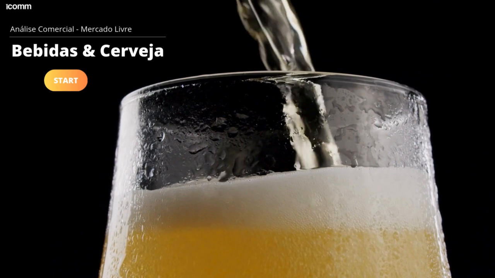

# 📊 Análise Comercial — Bebidas & Cerveja (Mercado Livre)

Projeto de análise comercial da categoria **Bebidas & Cerveja** no Mercado Livre.

🎬 **[Assista ao vídeo de apresentação](analise-comercial.mp4)**

## 🎯 Objetivo

<!-- ✏️ PREENCHA AQUI: qual pergunta essa análise responde?
Exemplo: "Entender o comportamento de vendas da categoria Bebidas & Cerveja
no Mercado Livre para apoiar decisões comerciais." -->
Analisar o desempenho comercial da categoria Bebidas & Cerveja no Mercado Livre.

## 🔍 Principais análises

<!-- ✏️ PREENCHA AQUI: liste 3 a 5 coisas que você analisou.
Exemplos:
- Produtos mais vendidos da categoria
- Faixa de preço com maior volume de vendas
- Comparativo entre marcas / vendedores
- Sazonalidade (meses com mais vendas) -->
- _(em breve — prints do dashboard e principais conclusões)_

## 🛠️ Ferramentas utilizadas

<!-- ✏️ Ajuste conforme o que você realmente usou -->
- Power BI — visualização e dashboard
- Excel — tratamento dos dados

## 📌 Conclusões

<!-- ✏️ PREENCHA AQUI: termine com "descobri que...".
É a parte que o recrutador mais valoriza! -->
- _(em breve)_
